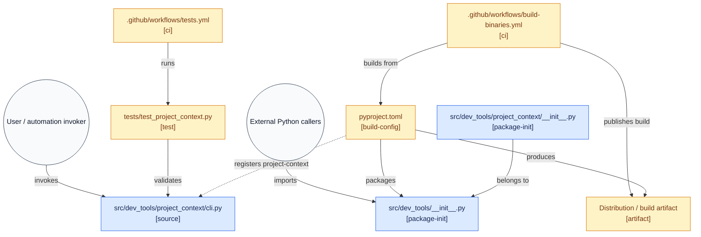

# project-context — Usage Guide

CLI utility that turns a Python repository into a single, LLM-ready context document. Part of the [dev-tools-collection](https://github.com/patan4ik/dev-tools-collection) toolbox — installable as a standalone command or usable as a frozen binary.

## Modes and measured token cost

As of v1.6.0, this table is generated directly by the tool's built-in `--report` command, run against this repository itself, measured with `tiktoken` (`cl100k_base` encoding).

| Mode | Purpose | Chars | Tokens | Reduction vs. full | Smaller |
|---|---|---|---|---|---|
| `--report` full dump | Full tree + full file contents | 205,609 | 48,790 | baseline | 1.0x |
| `--tree-only` | Architecture only + minimal KISS code exemplar + module graph | 14,229 | 3,397 | 93.0% fewer | 14.4x |
| `--signatures-only` | Function/class signatures via AST, no bodies, + module graph | 19,841 | 4,631 | 90.5% fewer | 10.5x |
| `--graph` | OKF-flavored per-module files with dependency links | 19,251 | 4,472 | 90.8% fewer | 10.9x |

**Note (v1.9.0/1.9.6):** every mode embeds a bounded KISS reference summary (module purpose + one complete, never-truncated representative function), not the raw file — this fixed an earlier issue where truncation cut a reference file off mid-function, wasting tokens on an unusable fragment. `--tree-only` uses a strictly minimal version of this summary (no import list) so it stays smaller than `--signatures-only`, which additionally lists every collected file's full signatures. Disable the whole baseline bundle with `--no-baseline` if you want the old, code-free lightweight behavior.

Note on `--graph`: it costs more tokens than `--signatures-only`, because each module carries its own YAML frontmatter and dependency links. The tradeoff isn't token savings — it's navigability. Use it when you want to open one module and immediately see its exact dependencies without loading the entire signature map at once.

Note on `--grep`: results vary heavily depending on how common the search pattern is in the codebase. A narrow class name matches few files (high reduction); a common term matches many files (lower reduction, as seen here: 70.1% vs. an earlier run's 87.8% on the same project with a different pattern set).

Running the default full-dump mode on more than 40 files without any scoping flag prints a warning to stderr, since unscoped dumps have been shown to correlate with degraded LLM output quality and unnecessary token spend.

## Installation

Install the whole collection in editable mode from the repo root:

```bash
pip install -e .
```

Optional extras:

```bash
pip install pyperclip   # only needed for --clipboard
pip install -e ".[report]"   # installs tiktoken, needed for --report
```

Once installed, the tool is available as the `project-context` command anywhere in your shell — no need to reference the file path.

## Examples

Starting a new LLM chat with full context:
```bash
project-context --output context.md
```

Mid-refactor update — only files you just edited:
```bash
project-context --changed-only --clipboard
```

Architecture-only review (e.g. onboarding a new AI session):
```bash
project-context --tree-only
```

Reviewing only logic related to a specific class or feature, with full detail:
```bash
project-context --grep "PortfolioSummary" --output portfolio_context.md
```

Getting a fast interface map without full code — cheapest way to give an LLM architectural awareness of a large codebase (measured 17.6x token reduction):
```bash
project-context --signatures-only --output signatures.md
```

OKF-flavored dependency graph — one markdown file per module with explicit import links, useful for scoped, iterative exploration:
```bash
project-context --graph --output project_graph
```

Splitting a large context into chunks under a model's context window:
```bash
project-context --max-chars 50000 --output context.md
```

Using XML-like output instead of Markdown:
```bash
project-context --format xml --output context.xml
```

Benchmarking all modes at once (requires `tiktoken`):
```bash
project-context --report --grep "YourClassName"
```

Disabling automatic convention detection (e.g. for a clean baseline comparison):
```bash
project-context --no-conventions --output context.md
```

Disabling the mandatory baseline files bundle and architecture plan gate entirely:
```bash
project-context --no-baseline --output context.md
```

Keeping the baseline files (dependency manifest, CI config, reference test) but dropping only the Step 1/Step 2 planning instructions:
```bash
project-context --no-plan-gate --output context.md
```

Declaring that a new module must be wired into existing entry points/CLI registries, not left standalone (new in v1.9.0):
```bash
project-context --integration-scope integrated --output context.md
```

Adding a deterministic, GitDiagram-style architecture diagram to `--tree-only` or `--signatures-only` output — plain text arrows by default, or a Mermaid flowchart for GitHub/Markdown rendering:
```bash
project-context --tree-only --diagram text --output tree.md
project-context --tree-only --diagram mermaid --output tree.md
```

Both are 100% deterministic (AST + regex + local git/CI-config parsing) — no LLM call, no network access, no GitHub API/token required. Detected relationships include `imports`, `registers entry point`, `belongs to`, `documents`, `packages`, `validates`, `runs`, `builds from`, `produces`, `publishes build`, and `invokes`. Disable with `--diagram none`.

## Recommended workflow

1. Start a new AI conversation with `--tree-only` so the model understands the architecture first.
2. If deep review is needed, follow up with `--signatures-only` to give the model an interface map at roughly 6% of the token cost of a full dump.
3. During iterative development, use `--changed-only --clipboard` to refresh the model with only what you've actually modified.
4. For focused debugging on one class or feature, use `--grep "ClassName"` — full implementation detail on relevant files only, at a token cost that depends heavily on how common the pattern is in your codebase.
5. For scoped, navigable exploration of one module and its dependencies, use `--graph` — it costs more tokens than `--signatures-only`, but structures the output as linked per-module files instead of one flat block.
6. Reserve the unscoped full-dump mode for small projects or first-time full audits — expect the warning on repositories with 40+ files.
7. Leave `PROJECT CONVENTIONS DETECTED` enabled by default for any code-generation task — it costs a small, fixed number of tokens per run and is the single change most likely to prevent an LLM from silently skipping your test suite, lint config, or dependency file.
8. Leave `MANDATORY BASELINE FILES` and the `ARCHITECTURE PLAN GATE` enabled for any task that adds real code — the forced pre-commitment plan is the single change most likely to catch a missing test file or a silently-skipped dependency update before the model finishes responding. Use `--no-plan-gate` alone if you want the baseline facts without the two-phase planning overhead.
9. Set `--integration-scope integrated` whenever the task explicitly requires wiring a new module into existing code (entry points, CLI registries, existing classes) — the default `standalone` scope tells the model to leave existing wiring untouched, which is the safer default for most "add a new tool" tasks but the wrong one for "add a new command to the existing CLI" tasks.

## PROJECT CONVENTIONS DETECTED (new in v1.7.0)

Earlier versions of this tool dumped facts about the repository — file trees, signatures, dependency graphs — and left it to the LLM to infer what those facts implied. Real end-to-end testing showed this doesn't work reliably: models consistently skipped unstated professional norms (e.g. "write a test for your new module by analogy") even when the evidence for that norm was sitting in plain text in the context, in every mode, including full dumps that literally contained the existing test file.

As of v1.7.0, `project-context` closes that gap. It detects five categories of project convention and renders them as an explicit, imperative section — **`PROJECT CONVENTIONS DETECTED`** — inserted at the top of every output mode, including `--tree-only` and `--graph`, so there is no lightweight mode where a convention can be silently dropped.

The five categories detected:

1. **Test coverage convention** — scans for `<module>.py` ↔ `tests/test_<module>.py` pairs, explicitly lists which modules already have tests and which don't, and instructs the model: if you generate a new tool, generate a matching test file too, even if the prompt never mentions testing.
2. **Lint / format / type / security gate** — parses `pyproject.toml` for `[tool.black]`, `[tool.ruff]`, `[tool.mypy]`, `[tool.bandit]`, `[tool.pytest]` sections, and checks for `.pre-commit-config.yaml`. If found, the model is told to write code as if it will actually be run through all of them — type hints on every function, no Bandit antipatterns like `eval` or unsanitized `subprocess` calls, etc.
3. **CI gate requirements** — reads `.github/workflows/*.yml` and detects, by regex, which checks (`pytest`, `mypy`, `bandit`, `coverage`) are actually *executed* in CI — not just configured somewhere, but treated as a merge-blocking gate.
4. **Dependency management** — identifies where dependencies are declared (`pyproject.toml` / `requirements.txt`) and requires that any new third-party import used by generated code be explicitly called out as a needed addition to that file, rather than silently assumed to be installed.
5. **Code style conventions** — samples up to 50 `.py` files via AST, computes the docstring coverage ratio across sampled functions, and determines the dominant naming convention (`snake_case` vs. mixed/camelCase), so new code doesn't stylistically stand out.

Disable this section — for example, to run a clean A/B baseline against an older prompt style — with:

```bash
project-context --no-conventions --output context.md
```
6. **Set `--integration-scope integrated`** whenever the task explicitly requires wiring a new module into existing code...
7. **Add `--diagram mermaid` to `--tree-only`** output when you want a paste-ready architecture diagram for a README, PR description, or design doc — it renders natively on GitHub. Use `--diagram text` (the default) when the output is only going to an LLM, since Mermaid's syntax overhead adds tokens an LLM doesn't need.

## MANDATORY BASELINE FILES + ARCHITECTURE PLAN GATE (new in v1.8.0, fixed in v1.8.1)

`PROJECT CONVENTIONS DETECTED` tells the model *what the rules are*. As of v1.8.0, `project-context` goes one step further and forces the model to *commit to a plan* before writing any code, and to *self-audit* against that plan afterward.

**MANDATORY BASELINE FILES** embeds, verbatim, the project's real contract files — dependency manifest, CI config, pre-commit config — detected by role/content signature rather than by a hardcoded filename, plus one real reference test file selected using stable Python/pytest/unittest rules (AST `assert`, `unittest.TestCase`, pytest fixtures/imports; `testpaths` from `pyproject.toml`/`pytest.ini`/`tox.ini`/`setup.cfg` if declared). This bundle is attached in every output mode, including `--tree-only`.

**ARCHITECTURE PLAN GATE** is a Plan-and-Solve style two-phase instruction block:
- **Step 1 — Architecture Plan (before code):** the model must state the target module path, the exact dependency-manifest diff, the test file it will add (modeled on the reference test file), which CI/lint/type/ security gates apply, and any version/security constraints.
- **Step 2 — Self-Validation Checklist (after code):** the model must re-read its own Step 1 plan and mark each item PASS/FAIL with a concrete artifact, so an incomplete response can't slip through unnoticed.

Disable both the bundle and the gate:
```bash
project-context --no-baseline --output context.md
```

Keep the baseline bundle but disable only the plan gate:
```bash
project-context --no-plan-gate --output context.md
```

**v1.8.1 fixes:** the `.txt` dependency-manifest detector previously flagged any plain-text file as a manifest on a bare word match; it now requires a real PEP 508 version specifier (with an unpinned-`requirements*.txt` name-based fallback). `--no-plan-gate` was a non-functional stub in v1.8.0 — it now actually suppresses the Step 1/Step 2 instructions in every output mode (`--format md`, `--format xml`, `--graph`) while keeping the baseline files intact.

## MANDATORY REFERENCE SOURCE MODULE + SENIOR-DEVELOPER MANDATE (new in v1.9.0)

Blind LLM-judge evaluation of v1.8.1 across all four output modes surfaced a consistent failure mode in the lightweight modes: given only a file tree or a signature list — but no real implementation — executor models frequently responded with clarifying questions and zero code, scoring Actionability 1/5 despite otherwise-honest Calibration.

v1.9.0 closes this gap with two changes that work together:

- **Mandatory reference source module**: one real, bounded, verbatim non-test source file is now selected and embedded in every mode, including `--tree-only` and `--signatures-only`. Selection prefers a module that looks like a CLI entry point (`def main(` plus an `if __name__ == "__main__":` guard); otherwise it falls back to the median-length source module, using the same representativeness logic as the existing reference-test-file selector. This gives the model a concrete example of the project's actual error handling, argument-parsing style, and docstring conventions — not just a shape of what's callable.
- **SENIOR-DEVELOPER MANDATE**: an explicit instruction block, injected immediately before the Architecture Plan Gate, that forbids responding with zero code. Ambiguous details must be resolved with a stated, reasonable assumption and an implementation delivered anyway; "insufficient context, do not guess" is now reserved strictly for details that would silently corrupt behavior (e.g. an unconfirmed business formula), never as grounds to withhold an entire response.

A companion flag, `--integration-scope {standalone,integrated}` (default `standalone`), removes a second common source of guessing: whether a new module should be wired into the project's existing entry points/CLI registry. Set `integrated` when the task explicitly requires touching existing code; the plan gate will then demand an explicit registration diff rather than just a new file.

Both additions are covered by the existing baseline toggle:
```bash
project-context --no-baseline --output context.md
```

## MODULE GRAPH / --diagram (new in v1.9.3, extended in v1.9.6)

`--tree-only` and `--signatures-only` can render the project's real dependency and wiring structure as an architecture diagram, in the spirit of tools like [GitDiagram](https://gitdiagram.com/) — but computed entirely offline from AST, regex, and local git/CI-config parsing, with no LLM call and no GitHub API access.

```bash
project-context --tree-only --diagram text     # plain arrow list (default for --tree-only)
project-context --tree-only --diagram mermaid  # Mermaid flowchart block
project-context --diagram none                 # suppress the module graph entirely
```

Detected relationships: `imports` (real Python import edges), `registers entry point` (from `pyproject.toml`'s `[project.scripts]`), `belongs to` (package hierarchy), `documents` (README → package), `packages` (manifest → root package), `validates` (test → the source files it actually references), `runs`/`builds from`/`produces`/`publishes build` (CI workflow ↔ tests ↔ manifest ↔ build artifact), and `invokes`/`imports` for two synthetic actor nodes added only when a real target exists.

Example Mermaid output for this repository:



One capability is intentionally **not** reproduced: GitDiagram's LLM-generated semantic descriptions (e.g. turning `__init__.py` into "Project context API / feature package"). That requires summarizing README/docstrings — inference, not extraction — and was left out to avoid presenting a hallucinated label as a detected fact.

`click` links to GitHub are added automatically when a `github.com` git remote is configured locally (no token, no API call) — synthetic nodes (actors, the "Distribution / build artifact" node) never get a link, since they aren't real repository paths.

## Benchmarking your own project

The tool has a built-in benchmark command — you no longer need to run separate scripts:

```bash
pip install tiktoken
project-context --report
project-context --report --grep "YourClassName"
```

This runs full, `--signatures-only`, `--graph` (and `--grep`, if provided) against the same root, measures both character and `cl100k_base` token counts for each, and prints a single comparison table.

Manual, single-mode runs are still available if you want the actual output file rather than just the metrics:

```bash
project-context --version
project-context --output full.md
project-context --signatures-only --output sig.md
project-context --grep "YourClassName" --output grep.md
project-context --graph --output project_graph
```

Sample outputs generated for benchmarking (e.g. `full.md`, `sig.md`, `grep.md`, `test_context.md`, `project_graph/`) are disposable — they are not consumed by the tool, its tests, or CI, and should not be committed to version control. Add them to `.gitignore` if you regenerate them locally.

## Running from source (without installing)

If you're developing the tool itself and want to run it directly from source without reinstalling:

```bash
python src/dev_tools/project_context/cli.py --tree-only
```

## Testing

```bash
pip install pytest
pytest tests/test_project_context.py -v
```

## Version history

See the root [`CHANGELOG.md`](../../../CHANGELOG.md) for the full history of changes.
